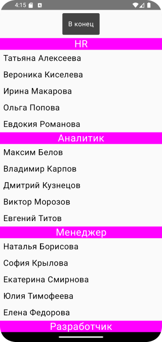
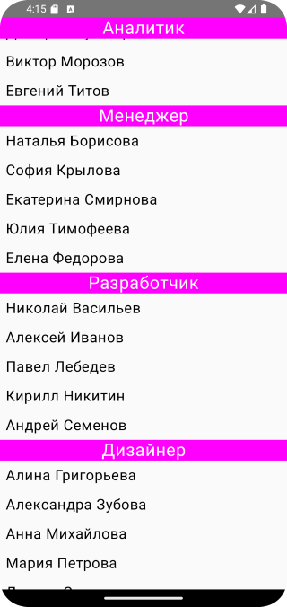
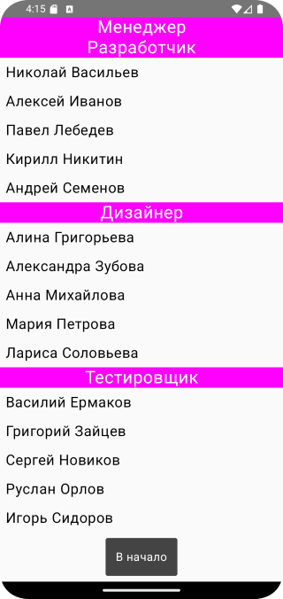

# Домашнее задание по теме "Software scrolling"

## Приложение «Отдел кадров»

Необходимо написать приложение на основепройденного материала, содержащее в себе данные о персонале организации. В качестве элемента, располагающего в себе данные использовать `LazyColumn`.

Имеющийся список персонала содержит в себе объекты класса со свойствами имени, фамилии, должности. Список состоит не менее чем из 24 персон. Штатное расписание должностей можно определить самостоятельно. Список перемешан, элементы располагаются в произвольном порядке.

На экране устройства с имеющейся вертикальной прокруткой при правильной работе приложения мы видим сгруппированный по должности вывод персонала под соответствующим заголовком, которые отображаются в отсортированном порядке по имени.

Кроме того функционально организована возможность по нажатию на текстовый элемент «В конец» и «В начало» перейти в конец списка, начало списка соответственно.

Примерный вариант отображения содержимого может выглядеть так:

Приложение необходимо сохранить проектом в удаленном репозитории, для проверки качества предоставить ссылку преподавателю, либо сделать скрины эмулятора при каждом шаге работы приложения или снять видео экрана при работе приложения 

## Скриншоты домашнего задания по теме "Software scrolling"

